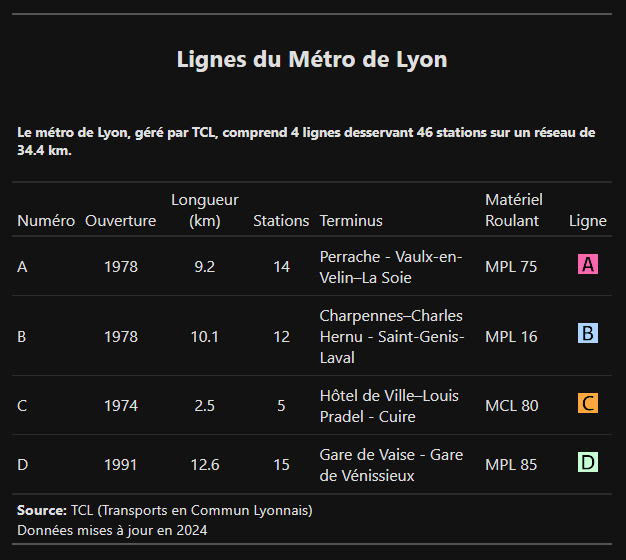

# Demo Great Tables - Métro de Lyon

Ce projet démontre l'utilisation de la librairie Great Tables pour créer des tableaux élégants en Python, en utilisant comme exemple les données du métro de Lyon.

## 🚇 À propos du projet

Ce projet illustre comment créer des tableaux professionnels avec Python en utilisant :
- La librairie Great Tables pour la mise en forme
- Polars pour la manipulation des données
- Les données du réseau de métro TCL de Lyon

## 🛠️ Installation

1. Cloner le repository :
```bash
git clone https://github.com/votre-username/demo_great_tables_metro_Lyon.git
cd demo_great_tables_metro_Lyon
```

2. Créer un environnement virtuel avec UV :
```bash
uv venv
```

3. Activer l'environnement virtuel :
```bash
# Windows
.venv/Scripts/activate
# Unix/MacOS
source .venv/bin/activate
```

4. Installer les dépendances :
```bash
uv pip install .
```

## 📊 Utilisation

Pour générer le tableau :
```bash
python lyon-metro.py
```

Le script va :
1. Charger les données du métro de Lyon
2. Créer un tableau formaté avec Great Tables
3. Ouvrir la visualisation dans votre navigateur par défaut

Le rendu est le suivant :



## 🔧 Structure du projet

```
demo_great_tables_metro_Lyon/
├── .venv/                   # Environnement virtuel
├── img/                     # Capture PNG du tableau généré
├── lyon-metro.py            # Script principal
├── pyproject.toml           # Configuration du projet
└── README.md                # Documentation
```

## 📚 Dépendances principales

- Python 3.12
- great-tables
- polars

## 🤝 Contribution

Les contributions sont les bienvenues ! N'hésitez pas à :
1. Fork le projet
2. Créer une branche pour votre fonctionnalité
3. Commiter vos changements
4. Pousser vers la branche
5. Ouvrir une Pull Request


## ✍️ Auteur

[Gael Penessot](https://www.linkedin.com/in/gael-penessot/)